# ⚽ AUCTION ARENA

<p align="center">
  <b>CREATE • BID • BUILD • WIN</b>
</p>

<p align="center">
  A competitive multiplayer football auction game where players create or join an auction room, compete for footballers, manage their budget, build their squad, arrange their final formation, and battle for victory.
</p>

---

## 🏟️ Welcome to Auction Arena

Auction Arena puts you in control of your own football squad.

But you don't simply select the best players.

You have to **compete for them**.

Create or join an auction room, enter live bidding battles against another manager, spend your budget carefully, win footballers, build your starting XI, and create the strongest possible formation.

<p align="center">
  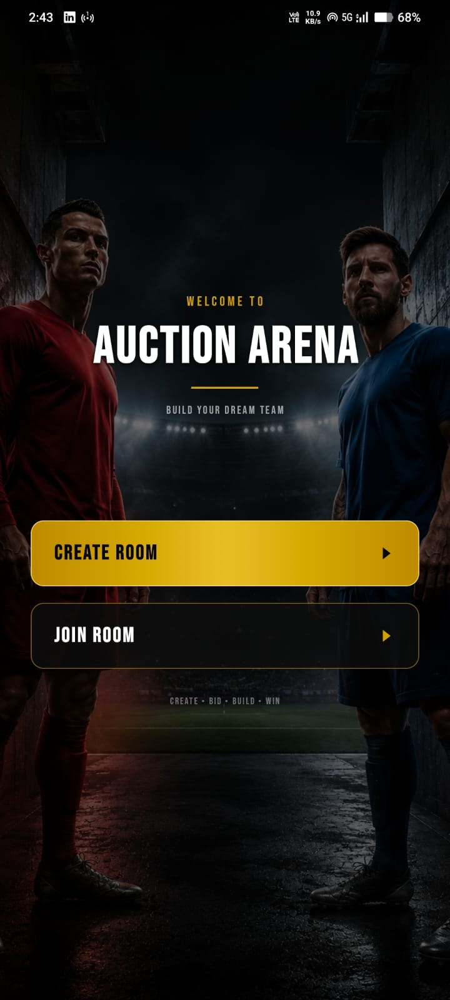
</p>

---

# 🎮 How the Game Works

## 1. Create or Join a Room

Start from the Auction Arena home screen.

You can either:

- **Create Room** — Start a new private football auction.
- **Join Room** — Enter an existing auction created by another player.

<p align="center">
  
</p>

---

## 2. Create Your Auction Room

When creating a room, enter your:

- **Room Name**
- **Host Name**

Then press **CREATE ROOM**.

Your auction room will be created and another manager can join the game.

<p align="center">
  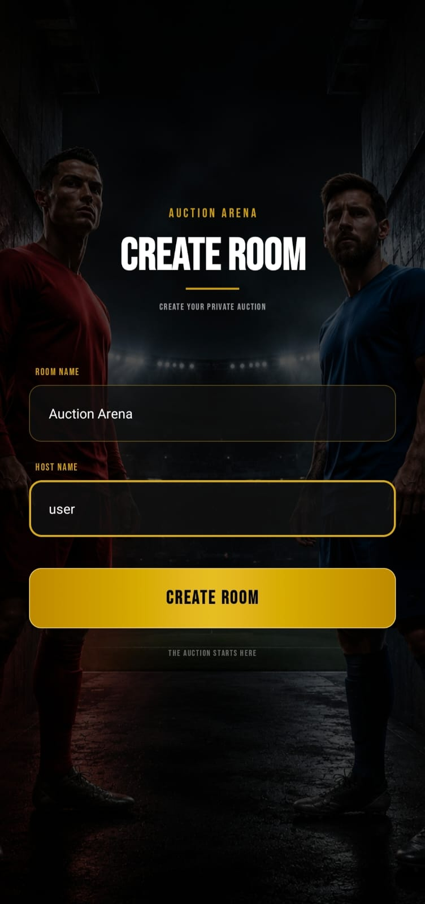
</p>

---

## 3. Join an Existing Room

The second manager can join the auction room and enter the game.

Once the players are connected, the football auction can begin.

<p align="center">
  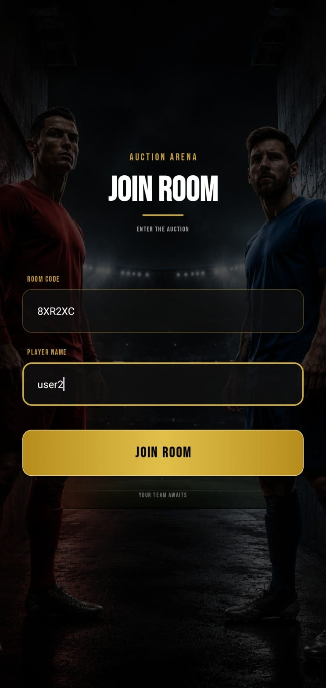
</p>

---

# 🔴 LIVE AUCTION

## 4. A Footballer Enters the Auction

Footballers are presented one at a time during the auction.

For every player, you can see:

- Player image
- Player name
- Football position
- Current bid
- Highest bidder
- Your remaining budget

You must decide how much the player is worth to your squad.

<p align="center">
  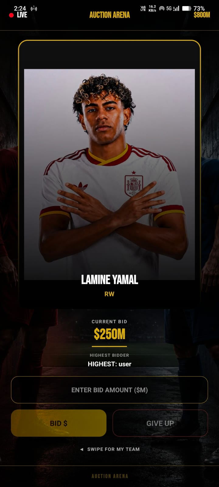
</p>

---

## 5. Place Your Bid

Enter the amount you want to bid and press:

**BID $**

The bid is immediately reflected in the auction.

If your bid becomes the highest bid, you take the lead.

But the other manager can respond with a higher offer.

<p align="center">
  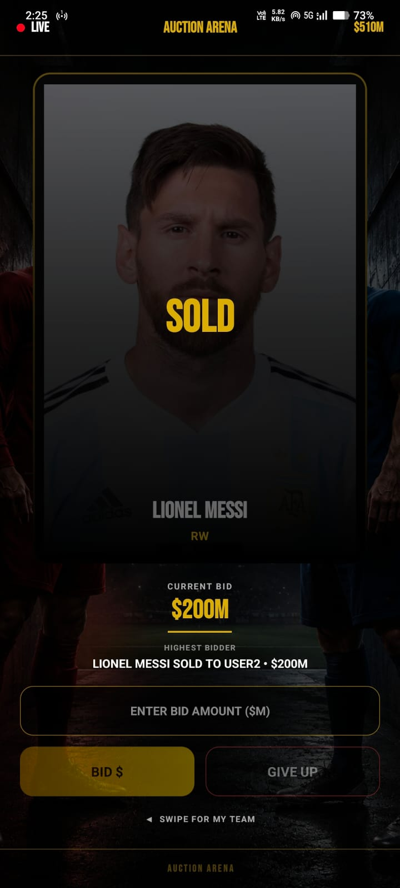
</p>

---

## 💰 Manage Your Budget

Every manager starts with a limited auction budget.

That means you cannot simply bid huge amounts for every superstar.

You need to decide:

- Which players are worth fighting for
- When to increase your bid
- When to save money
- When to give up
- How much budget you need for the rest of your squad

Winning one expensive player could mean having less money available for another position later.

Your budget is therefore a major part of the strategy.

---

## 6. SOLD!

When the bidding for a player finishes, the footballer is:

# SOLD

The player goes to the manager who placed the winning bid.

The winning amount is deducted from that manager's available budget, and the footballer becomes part of their squad.

<p align="center">
  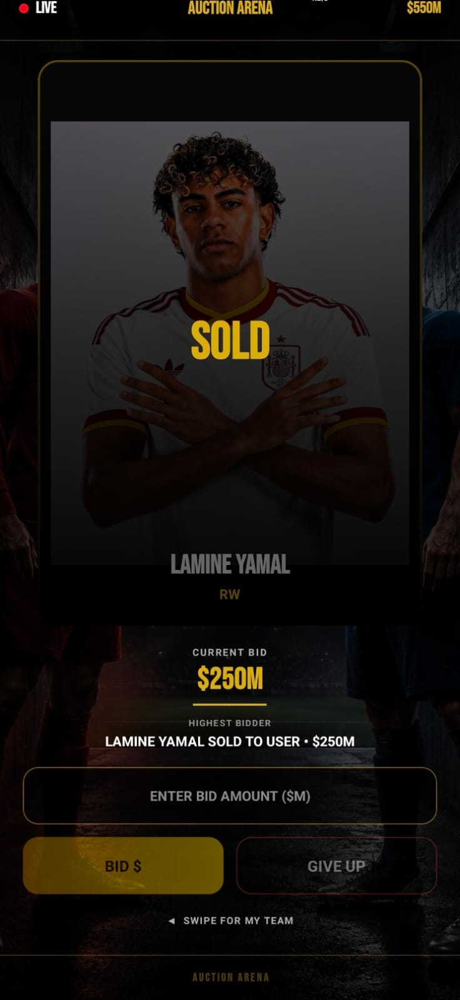
</p>

The auction then continues with the next footballer.

This process continues as both managers compete to build their squads.

---

# ⚽ BUILD YOUR FORMATION

## 7. Build Your Starting XI

After acquiring your footballers, the next challenge is building your formation.

Your objective is to place:

**11 / 11 players**

on the football pitch.

<p align="center">
  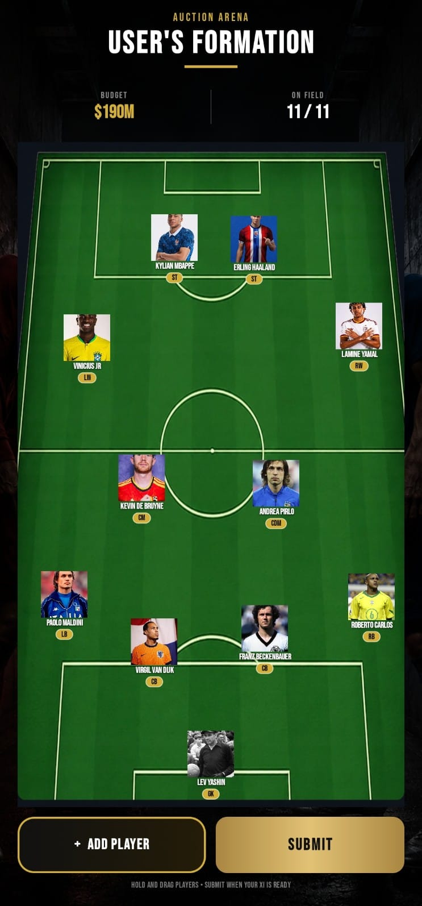
</p>

Your formation can include positions such as:

- GK — Goalkeeper
- LB — Left Back
- RB — Right Back
- CB — Centre Back
- CDM — Defensive Midfielder
- CM — Central Midfielder
- CAM — Attacking Midfielder
- LW — Left Wing
- RW — Right Wing
- ST — Striker

---

## 8. Drag and Position Your Players

Players are not locked permanently into one place on the formation screen.

You can:

**Hold → Drag → Drop**

a player anywhere on the football pitch.

This allows you to build the tactical setup you want.

Moving a player into a different area of the pitch changes the position represented by that location.

This means squad building is not finished when the auction ends — you still need to create a strong and balanced starting XI.

---

## 9. Complete Your XI

Continue adding and positioning players until your formation reaches:

# 11 / 11

Your completed squad is now ready for submission.

<p align="center">
  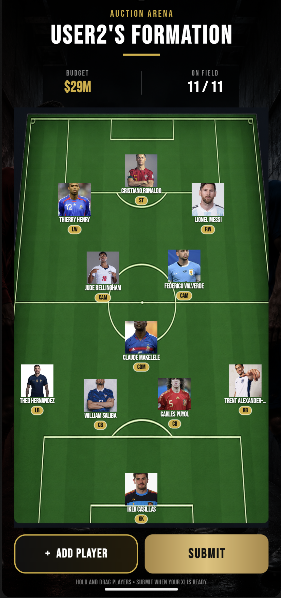
</p>

Before submitting, check that:

- Your goalkeeper is correctly positioned
- Your defence is balanced
- Your midfield has enough control
- Your attacking players are positioned effectively
- All 11 players are on the field

---

# ✅ SUBMIT YOUR FORMATION

## 10. Confirm Your Final XI

When your starting XI is ready, press:

**SUBMIT**

Auction Arena will ask you to confirm your final formation.

<p align="center">
  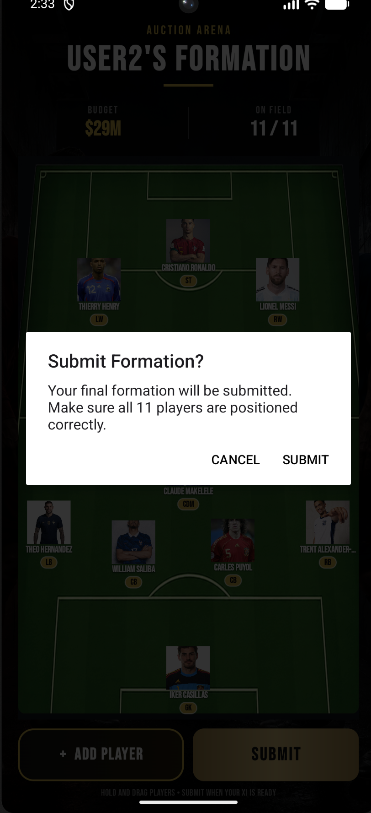
</p>

Once confirmed, your formation is submitted.

You can then wait for the other manager to finish and submit their formation.

---

# 🏆 MATCH RESULT

## 11. The Final Result

After the required formations have been submitted, Auction Arena evaluates the teams and determines the result.

Your final team is influenced by the squad you purchased during the auction and how you built your formation.

This means decisions made during the entire game matter:

**Your bids matter.**

**Your budget matters.**

**Your players matter.**

**Your formation matters.**

---

## 🏆 Victory

If your squad achieves the stronger result:

# VICTORY

Your final team score is displayed with the result.

<p align="center">
  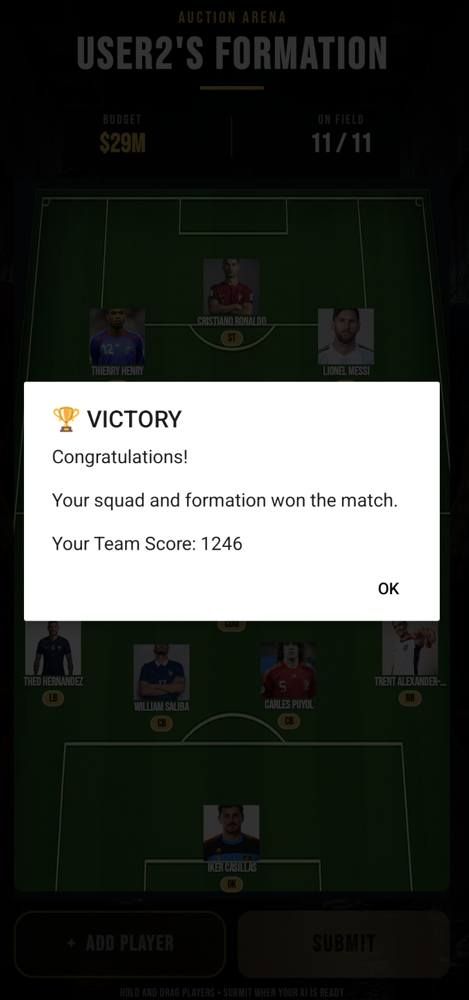
</p>

---

## Defeat

If the opposing manager finishes with the stronger result:

# DEFEAT

The winning manager and your final team score are displayed.

<p align="center">
  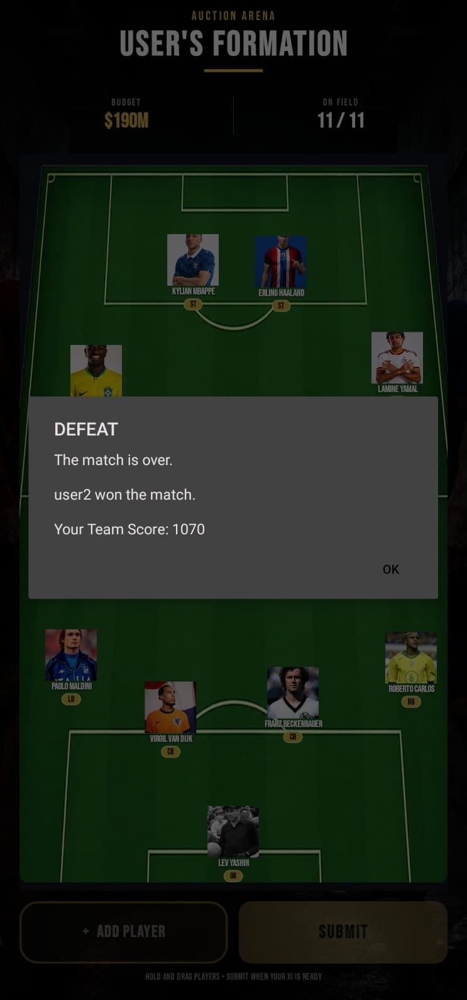
</p>

---

# 🔥 THE COMPLETE AUCTION ARENA EXPERIENCE

The complete gameplay flow is simple:

```text
CREATE / JOIN ROOM
        ↓
START AUCTION
        ↓
BID FOR PLAYERS
        ↓
MANAGE YOUR BUDGET
        ↓
WIN PLAYERS
        ↓
BUILD YOUR SQUAD
        ↓
CREATE YOUR STARTING XI
        ↓
POSITION YOUR PLAYERS
        ↓
SUBMIT FORMATION
        ↓
VICTORY OR DEFEAT
```

---

<p align="center">
  <b>AUCTION ARENA</b>
</p>

<p align="center">
  <b>CREATE • BID • BUILD • WIN</b>
</p>